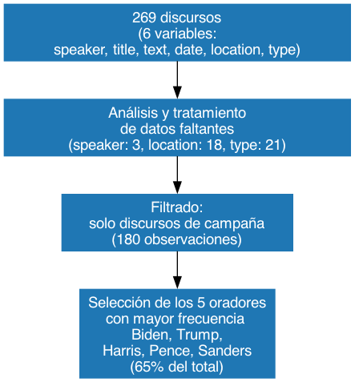

```{python}
from time import time
from pathlib import Path
from great_tables import GT

import pandas as pd
import matplotlib.pyplot as plt
import seaborn as sns
import networkx as nx
import numpy as np
from tabulate import tabulate
import re

from collections import Counter
from nltk.corpus import stopwords

import nltk

sns.set_theme(style="whitegrid")


df_speeches = pd.read_csv('../data/us_2020_election_speeches.csv')
df_speeches["date"] = pd.to_datetime(df_speeches["date"])


speeches = df_speeches[df_speeches["type"] == "Campaign Speech"]

# group speeches by speaker
#speeches["speaker"].value_counts()

# group speeches by speaker and date
#speeches.groupby(["date", "speaker"]).value_counts()

# filter speeches by donald trump
#speeches[speeches["speaker"] == "Donald Trump"]

#print(speeches.describe())

top5_speakers = speeches["speaker"].value_counts().head(5).index
top_speeches = speeches[speeches["speaker"].isin(top5_speakers)]

def clean_text(df, column_name):
    result = df[column_name]

    # quitar todo hasta el primer \n (introducción del texto, que a veces repite el orador)
    result = result.str.replace(r"^[^\n]*\n", "", regex=True)

    # convertir a minúsculas
    result = result.str.lower()

    # eliminar encabezados del orador tipo "joe biden:" con espacios
    result = result.str.replace(
        r"\b(joe biden|donald trump|kamala harris|mike pence|bernie sanders|president trump)\s*:", 
        "", 
        regex=True
    )

    # eliminar signos de puntuación definidos
    result = result.str.replace(r"[{}\n]".format(re.escape("[],:?.!;\"'")), " ", regex=True)

    # eliminar espacios extra
    result = result.str.replace(r"\s+", " ", regex=True).str.strip()

    return result


# creamos columna clentext
top_speeches["CleanText"] = clean_text(top_speeches, "text")

# Convierte párrafos en listas "palabra1 palabra2 palabra3" -> ["palabra1", "palabra2", "palabra3"]
top_speeches["WordList"] = top_speeches["CleanText"].str.split()

stop_words = set(stopwords.words('english'))

if "WordList" not in top_speeches.columns:
    top_speeches["WordList"] = top_speeches["CleanText"].str.split()

custom_stopwords = {"it’s"}

top_speeches["FilteredWordList"] = top_speeches["WordList"].apply(
    lambda words: [
        word for word in words 
        if word not in stop_words and word not in custom_stopwords and len(word) > 2
    ]
)

# contar palabras por candidato
word_counts = {}
for speaker in top_speeches["speaker"].unique():
    all_words = top_speeches[top_speeches["speaker"] == speaker]["FilteredWordList"].explode()
    word_counts[speaker] = Counter(all_words)

# crear un df con las palabras más frecuentes
top_words = pd.DataFrame([
    {"speaker": speaker, "word": word, "count": count}
    for speaker, counts in word_counts.items()
    for word, count in counts.most_common(10)
])
# reordenamos por frecuencia
top_words = top_words.sort_values(by=["count"], ascending=[False])


formula_map = {
    "Joe Biden": "Joe Biden & Kamala Harris",
    "Kamala Harris": "Joe Biden & Kamala Harris",
    "Donald Trump": "Donald Trump & Mike Pence",
    "Mike Pence": "Donald Trump & Mike Pence"
}

eventos = [
    {"fecha": "2020-04", "texto": "Retiro de Bernie Sanders", "altura": 0.2},
    {"fecha": "2020-07", "texto": "Inicio campaña Kamala Harris", "altura": 0.5},
    {"fecha": "2020-08", "texto": "Formulas: \nBiden & Harris\nTrump & Mike Pence", "altura": 0.7},
    {"fecha": "2020-09", "texto": "Debate presidencial en TV", "altura": 0.9},
]

formula_palette = {
    "Joe Biden & Kamala Harris": "#56B4E9",   # Azul claro
    "Donald Trump & Mike Pence": "#E69F00",   # Naranja dorado
    "Otros": "#999999"                        # Gris
}


```

## Datos

**Funnel**

<div style="text-align: center;">
  
</div>

**Pipeline de limpieza (sobre la columna text)**

<div style="text-align: center;">
  
</div>

---


## Palabras más frecuentes por fórmula

:::{.center}

```{python}
top_speeches["formula"] = top_speeches["speaker"].map(formula_map)
formula_speeches = top_speeches.dropna(subset=["formula"])

formula_word_counts = {}
for formula in formula_speeches["formula"].unique():
    all_words = formula_speeches[formula_speeches["formula"] == formula]["FilteredWordList"].explode()
    formula_word_counts[formula] = Counter(all_words)

top_formula_words = pd.DataFrame([
    {"formula": formula, "word": word, "count": count}
    for formula, counts in formula_word_counts.items()
    for word, count in counts.most_common(15)
])

top_formula_words = top_formula_words.sort_values(by="count", ascending=False)


plt.figure(figsize=(7, 6))
sns.barplot(data=top_formula_words, x="count", y="word", hue="formula", dodge=False, palette=formula_palette, edgecolor="black")
#plt.title("Palabras Más Frecuentes por Fórmula Presidencial")
plt.xlabel("Frecuencia")
plt.ylabel("Palabras")
plt.legend(title="Fórmula", loc='lower right')
plt.tight_layout()
plt.show()
```

:::


## Menciones entre candidatos

:::{.center}


```{python}
mention_aliases = {
    "Joe Biden": [r"\bjoe biden\b", r"\bjoe\b", r"\bbiden\b"],
    "Donald Trump": [r"\bdonald trump\b", r"\bdonald\b", r"\btrump\b"],
    "Kamala Harris": [r"\bkamala harris\b", r"\bkamala\b", r"\bharris\b"],
    "Mike Pence": [r"\bmike pence\b", r"\bmike\b", r"\bpence\b"],
    "Bernie Sanders": [r"\bbernie sanders\b", r"\bbernie\b", r"\bsanders\b"]
}


candidates = top_speeches["speaker"].unique()
mentions_matrix = pd.DataFrame(0, index=candidates, columns=candidates)

# Iteramos sobre cada discurso
for speaker in candidates:
    speaker_speeches = top_speeches[top_speeches["speaker"] == speaker]

    for mentioned in candidates:
        if speaker == mentioned:
            count = 0
            count += 1 
            
        patterns = mention_aliases[mentioned]

        count = 0
        for _, row in speaker_speeches.iterrows():
            text = row["CleanText"].lower()

            # ¿Aparece alguno de los alias?
            found = False
            for pat in patterns:
                if re.search(pat, text):
                    found = True
                    break

            if found:
                count += 1

        mentions_matrix.loc[speaker, mentioned] = count

plt.figure(figsize=(8, 6))
sns.heatmap(mentions_matrix, annot=True, fmt="d", cmap="Blues", cbar=False)
#plt.title("Matriz de Menciones entre Candidatos")
plt.xlabel("Mencionado")
plt.ylabel("Candidato")
plt.tight_layout()
plt.show()
```

:::

---


## Futuros análisis

- **Análisis de sentimientos:**
Explorar el tono emocional (positivo, negativo, neutral) de los discursos y su evolución a lo largo de la campaña.

- **Menciones entre candidatos:**
Analizar si las menciones entre candidatos son agresivas o elogiosas, y cómo varían en momentos clave.

- **Análisis geográfico:**
Investigar diferencias en las localidades donde los candidatos realizan sus discursos y sus estrategias regionales.

---

## ¿Preguntas?


### ¡Gracias!

Link al repositorio: [https://github.com/campon/intro-cd](hhttps://github.com/campon/intro-cd)
