```{python}
import re
import os

from time import time
from pathlib import Path

import numpy as np
import pandas as pd
import matplotlib.pyplot as plt
import seaborn as sns

from nltk.corpus import stopwords
import nltk
import matplotlib.patches as mpatches


from sklearn.model_selection import train_test_split
from sklearn.feature_extraction.text import CountVectorizer
from sklearn.feature_extraction.text import TfidfTransformer
from sklearn.decomposition import PCA
from sklearn.naive_bayes import MultinomialNB
from sklearn.metrics import accuracy_score, confusion_matrix
from sklearn.metrics import precision_score, recall_score
from sklearn.metrics import ConfusionMatrixDisplay
from sklearn.model_selection import GridSearchCV
from sklearn.linear_model import LogisticRegression

sns.set_theme(style="whitegrid")
```


```{python}
df_speeches = pd.read_csv('../data/us_2020_election_speeches.csv')
```


## Introducción

En este trabajo se explora 269 discursos políticos recogidos durante la campaña presidencial de Estados Unidos en 2020. Se han seleccionado los cinco oradores con mayor cantidad de intervenciones (Joe Biden, Donald Trump, Mike Pence, Bernie Sanders y Kamala Harris) tras confirmar, mediante una revisión automatizada y manual, que los datos son lo suficientemente completos y homogéneos para un estudio riguroso de patrones de publicación y análisis textual.

La base de datos incluye seis variables: tres categóricas (*speaker*, *type*, *location*), dos de texto (*title*, *text*) y una temporal (*date*). Los registros comprenden intervenciones realizadas entre el 15 de enero y el 16 de octubre de 2020. Para preparar el corpus se implementó una función de limpieza que:

1. Elimina la introducción redundante en el texto, suprimiendo el contenido previo al primer salto de línea.
2. Convierte todo el texto a minúsculas para evitar duplicaciones por diferencias de mayúsculas.
3. Elimina marcas de tiempo (por ejemplo, (00:01) o (1:05:12)) comunes en transcripciones automáticas.
4. Suprime encabezados de oradores (como "joe biden:" o "president trump") para evitar distorsiones en el conteo de palabras.
5. Quita signos de puntuación innecesarios y espacios adicionales.

Esta cadena de transformaciones permite obtener un vocabulario depurado y coherente que resulta indispensable para análisis posteriores como el estudio de frecuencias, sentimientos o co‐ocurrencias de términos.


```{python}

def clean_text(df, column_name):
    result = df[column_name]

    # quitar todo hasta el primer \n (introducción del texto, que a veces repite el orador)
    result = result.str.replace(r"^[^\n]*\n", "", regex=True)

    # convertir a minúsculas
    result = result.str.lower()

    # eliminar timestamps como (00:01), (1:05:12), etc.
    result = result.str.replace(r"\(\d{1,2}:\d{2}(?::\d{2})?\)", " ", regex=True)

    # eliminar encabezados del orador tipo "joe biden:" con espacios
    result = result.str.replace(
        r"\b(joe biden|donald trump|kamala harris|mike pence|bernie sanders|president trump)\s*:", 
        "", 
        regex=True
    )

    # eliminar signos de puntuación definidos
    result = result.str.replace(r"[{}\n]".format(re.escape("[],:?.!;\"'")), " ", regex=True)

    # eliminar espacios extra
    result = result.str.replace(r"\s+", " ", regex=True).str.strip()

    return result
# Realizar la limpieza de los datos que crea pertinente. Se espera que usen la función clean_text() de la entrega anterior.
df_speeches_clean = df_speeches.copy()
df_speeches_clean['text'] = clean_text(df_speeches_clean, 'text')

```

```{python}
#| label: fig-frecuencia-dicursos
#| fig-cap: Frecuencia de discursos por candidato (Campaña 2020).
#| fig-width: 3
#| fig-height: 3

# Filtrar top 5 oradores para graficar
top_5_candidates = df_speeches_clean["speaker"].value_counts().head(5).index
data_top5 = df_speeches_clean[df_speeches_clean["speaker"].isin(top_5_candidates)]

# Crear figura
plt.figure(figsize=(6, 6))
ax = sns.countplot(data=data_top5, x="speaker", order=top_5_candidates)

# Títulos y etiquetas
#plt.title("Frecuencia de discursos por orador (Campaña 2020)", fontsize=14, weight='bold')
plt.xlabel("Candidato", fontsize=11)
plt.ylabel("Cantidad de discursos", fontsize=11)

# Mostrar valores sobre cada barra
for p in ax.patches:
    height = int(p.get_height())
    ax.annotate(f'{height}', 
                (p.get_x() + p.get_width() / 2., height), 
                ha='center', va='bottom', fontsize=10)

# Ajustar espaciado y estética
plt.xticks(fontsize=8)
plt.yticks(fontsize=9)
plt.grid(axis='y', alpha=0.5)
sns.despine()  # Elimina borde superior y derecho

plt.tight_layout()
plt.savefig("fig-frecuencia-dicursos.png", dpi=350)
plt.close()

```

::: {.cell-output-display}
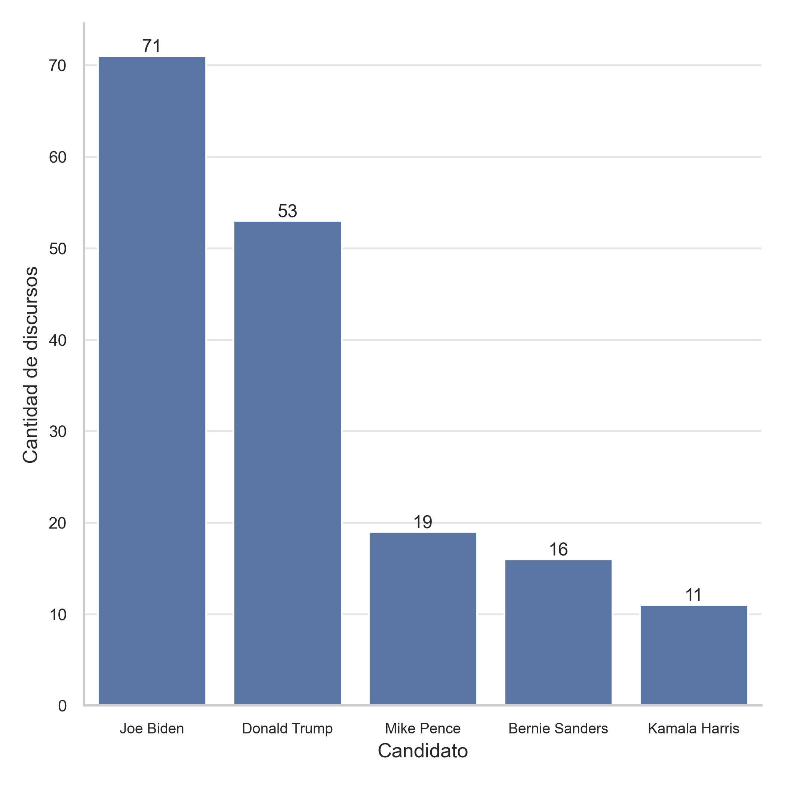{ width=65% #fig-frecuencia-dicursos fig-pos='htpb'}
:::

La [@fig-frecuencia-dicursos] muestra la frecuencia de discursos por candidato en la campaña presidencial de Estados Unidos 2020. Se observa que Joe Biden y Donald Trump son los candidatos con mayor número de discursos, seguidos por Mike Pence, Bernie Sanders y Kamala Harris. Esta distribución refleja la actividad política y mediática de cada candidato durante la campaña.

```{python}

# Filtramos los 3 candidatos con más discursos.
top_3_candidates = df_speeches_clean["speaker"].value_counts().head(3).index

df_speeches_top_3 = df_speeches_clean[
     df_speeches_clean["speaker"].isin(top_3_candidates)
].reset_index(drop=True)
#df_speeches_top_3

```

Tras seleccionar los tres candidatos con más discursos: Joe Biden, Donald Trump y Mike Pence, se procede a dividir el conjunto de datos en dos partes: un conjunto de desarrollo (entrenamiento) y un conjunto de prueba (test). Esta división nos permite evaluar el rendimiento de los modelos de clasificación en datos no vistos, asegurando que las métricas obtenidas sean representativas del desempeño real del modelo. Para construir estos conjuntos, se utiliza un muestreo estratificado, garantizando que la proporción de discursos de cada candidato se mantenga en ambos conjuntos. Esto es crucial para evitar sesgos en el modelo y asegurar una evaluación justa. Observese la [@fig-frecuencia-test_train], que muestra la distribución de discursos por candidato en los conjuntos de desarrollo y prueba, confirmando que la proporción de discursos se mantiene constante entre ambos conjuntos.

```{python}

# 1: Separar 30% del conjunto para test. Al resto lo llamamos "dev" (desarrollo).

X_dev, X_test, y_dev, y_test = train_test_split(
    df_speeches_top_3["text"], 
    df_speeches_top_3["speaker"], 
    stratify=df_speeches_top_3["speaker"], 
    test_size=0.3, 
    random_state=42
)
#print(f"Tamaños de los conjuntos: {df_speeches_top_3.shape}")
#print(f"Tamaños de los conjuntos: {X_dev.shape}, {X_test.shape}")
#print(y_dev.unique())

```

```{python}
#| label: fig-frecuencia-test_train
#| fig-cap: Distribución de discursos por candidato y conjunto.
#| fig-width: 3
#| fig-height: 3

# 2: Visualización de la proporción de cada candidato por conjunto

def plot_candidate_distribution_relative(y_dev, y_test):
    import pandas as pd
    import matplotlib.pyplot as plt
    import seaborn as sns

    # Unificar datos
    df_dev = pd.DataFrame({'candidato': y_dev, 'conjunto': 'Desarrollo'})
    df_test = pd.DataFrame({'candidato': y_test, 'conjunto': 'Prueba'})
    df = pd.concat([df_dev, df_test])

    # Selección de top 3 candidatos
    top_3_candidates = df['candidato'].value_counts().head(3).index
    df = df[df['candidato'].isin(top_3_candidates)]

    # Calcular proporciones relativas (cada fila suma 1)
    counts = df.groupby(['candidato', 'conjunto']).size().unstack(fill_value=0)
    proportions = counts.div(counts.sum(axis=1), axis=0)

    # Graficar
    plt.figure(figsize=(6, 6))
    sns.set(style="whitegrid")
    ax = sns.countplot(data=df, x='candidato', hue='conjunto',
                       palette='pastel', order=top_3_candidates)

    # Anotar porcentaje relativo en cada barra
    for p in ax.patches:
        height = p.get_height()
        if height == 0:
            continue
        
        x = p.get_x() + p.get_width() / 2

        # Obtener valores de los ejes
        candidato = p.get_x() + p.get_width() / 2.
        grupo = p.get_label()  # no funciona, vamos manual

        # Alternativa: extraer texto del eje X y hue desde el objeto de la barra
        # Primero: obtener nombre del candidato (eje X)
        candidato_idx = int(p.get_x() + p.get_width() / 2)
        candidato_name = p.get_x() + p.get_width() / 2.

        # Alternativa segura: obtener valores desde la posición de la barra
        candidato = p.get_x() + p.get_width() / 2.
        # Pero mejor: usemos `get_x()` y `get_width()` para detectar el nombre con orden
        x_idx = round(p.get_x() + p.get_width() / 2.)
        candidato = ax.get_xticklabels()[x_idx].get_text()

        # Color define el conjunto (posición en leyenda)
        color = p.get_facecolor()
        conjunto = 'Desarrollo' if color == ax.patches[0].get_facecolor() else 'Prueba'

        # Extraer proporción
        try:
            porcentaje = proportions.loc[candidato, conjunto]
            ax.annotate(f'{porcentaje:.1%}',
                        (x, height),
                        ha='center', va='bottom', fontsize=9)
        except KeyError:
            continue  # Por si falta el dato

    # Estética
    #plt.title('Distribución de discursos por candidato y conjunto', fontsize=14, weight='bold')
    plt.xlabel('Candidato', fontsize=11)
    plt.ylabel('Cantidad de discursos', fontsize=11)
    plt.legend(title='Conjunto', fontsize=8, title_fontsize=10)
    plt.xticks(fontsize=8)
    plt.yticks(fontsize=9)
    plt.tight_layout()
    sns.despine()
    plt.savefig("fig-frecuencia-test_train.png", dpi=350)
    plt.close()

plot_candidate_distribution_relative(y_dev, y_test)
```

::: {.cell-output-display}
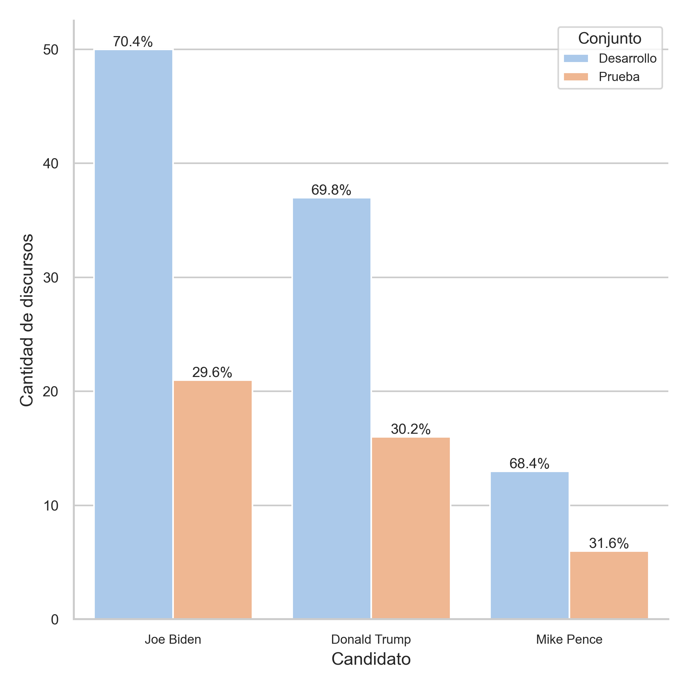{ width=60% #fig-frecuencia-test_train fig-pos='htpb'}
:::

Para transformar el texto del conjunto de entrenamiento a una representación numérica se utilizó la técnica de Bag of Words (BoW), implementada a través del $\texttt{CountVectorizer}$ de $\texttt{scikit-learn}$. Esta técnica convierte cada documento en un vector donde cada componente representa la frecuencia absoluta de una palabra específica del vocabulario del corpus.

BoW parte del supuesto de que el orden de las palabras no importa. Se construye una matriz $D×V$, donde, 4 es la cantidad de discursos (filas), $V$ es el tamaño del vocabulario total (columnas), y cada celda $[i,j]$ contiene el número de veces que la palabra $j$ aparece en el documento $i$.

En otras palabras, cada documento se representa como un vector de conteo de palabras, sin importar su contexto o posición.

Se transforma el conjunto de entrenamiento de dos maneras:

a. Unigramas incluyendo stopwords
No se eliminan palabras vacías (stopwords), por lo que el vocabulario es más amplio pero contiene muchas palabras con poca capacidad discriminativa. Entre los 100 discursos existen 13.704 palabras únicas (unigramas) en el corpus. La matriz resultante tiene una proporción de entradas no nulas: ~0.0889.


b. Unigramas + bigramas, excluyendo stopwords en inglés
Se remueven stopwords usando la lista estándar del idioma inglés y se incluyen también combinaciones de dos palabras (bigramas), lo cual expande el tamaño del vocabulario pero aporta información contextual más rica. La dimensión de la matriz resulta en los 100 discursos, 197.501 combinaciones de bigramas — es decir, un vocabulario muchísimo más grande al incorporar combinaciones de dos palabras. La matriz resultante tiene una proporción de entradas no nulas: ~0.0197.

A pesar del alto número de columnas (features), cada documento contiene solo un pequeño subconjunto del vocabulario total, por lo que la mayoría de las entradas de la matriz son ceros. Por esta razón, la matriz resultante es una matriz dispersa y para ahorrar memoria y acelerar los cálculos son almacenadas guardando únicamente las entradas no nulas. De hecho, en el caso del vectorizador con unigramas y bigramas, la matriz tiene casi 200 mil columnas, pero menos del 2% de sus celdas contienen información distinta de cero. En el primer caso, con unigramas y stopwords, la matriz tiene más de 13 mil columnas, pero menos del 9% de sus celdas contienen información distinta de cero.

Este comportamiento es típico en tareas de procesamiento de lenguaje natural. Si se trabajara con millones de documentos, representar esta matriz como densa (con todos los ceros explícitos) consumiría cantidades de memoria astronómicas e inviables para la mayoría de los equipos. Por ello, se emplean estructuras de datos especializadas que almacenan únicamente las posiciones y valores de las entradas no nulas, permitiendo un uso eficiente de la memoria y un procesamiento más rápido. Esta técnica es sencilla y efectiva, pero produce vectores de alta dimensionalidad y dispersos, lo que hace fundamental el uso de representaciones dispersas para su manejo computacional.


Una mejor representación que Bag of Words, se puede utilizar TF-IDF (Term Frequency-Inverse Document Frequency), que pondera la importancia de cada palabra en el contexto del corpus, reduciendo el impacto de palabras comunes y mejorando la capacidad discriminativa del modelo. Un ejemplo de la representación de TF-IDF se muestra a continuación: 


- Documento 1: "el gato come pescado"
- Documento 2: "el perro come carne"

El vocabulario es: ["el", "gato", "come", "pescado", "perro", "carne"]

Para cada término, calculamos:

- TF (frecuencia de término): número de veces que aparece la palabra en el documento.
- DF (document frequency): número de documentos donde aparece la palabra.
- IDF (inversa de la frecuencia de documento):  
  $$\text{IDF}(t) = \log\left(\frac{N}{DF(t)}\right)$$
  donde $N$ es el número total de documentos.

Por ejemplo, para la palabra "gato":

- TF en Documento 1: 1, en Documento 2: 0

- DF: 1 (solo aparece en Documento 1)

- IDF: log(2/1) = 0.301

Para la palabra "el":

- TF en ambos documentos: 1

- DF: 2 (aparece en ambos)

- IDF: log(2/2) = 0

El vector TF-IDF para **Documento 1** sería:

- ["el": 0, "gato": 0.301, "come": 0, "pescado": 0.301, "perro": 0, "carne": 0]

**Mientras que para Documento 2**:

- ["el": 0, "gato": 0, "come": 0, "pescado": 0, "perro": 0.301, "carne": 0.301]

Es importante señalar que los modelos basados en representaciones bag-of-words o TF-IDF tienen limitaciones: ignoran el orden y contexto de las palabras y generan vectores de alta dimensionalidad y dispersos, lo que puede dificultar capturar relaciones semánticas complejas.


```{python}
# 3: Transforme el texto del conjunto de entrenamiento a la representación numérica (features) de conteo de palabras o bag of words.

vectorizer = CountVectorizer(
    stop_words=None,
    lowercase=True,
    token_pattern=r"(?u)\b\w+\b",
    ngram_range=(1, 1))

X_dev_counts = vectorizer.fit_transform(X_dev)
#print(f"Dimensiones de la matriz de conteo: {X_dev_counts.shape}")
#print(f"Proporción de entradas no cero: {X_dev_counts.nnz / X_dev_counts.shape[0] / X_dev_counts.shape[1]}")


vectorizer2 = CountVectorizer(
    stop_words=stopwords.words("english"),
    lowercase=True,
    token_pattern=r"(?u)\b\w+\b",
    ngram_range=(1, 2))

X_dev_counts2 = vectorizer2.fit_transform(X_dev)

#print(f"Dimensiones de la matriz de conteo: {X_dev_counts2.shape}")
#print(f"Proporción de entradas no cero: {X_dev_counts2.nnz / X_dev_counts2.shape[0] / X_dev_counts2.shape[1]}")
```

```{python}
# 4: Obtenga la representación numérica Term Frequency - Inverse Document Frequency.

X_dev_tfidf = TfidfTransformer(use_idf=True).fit_transform(X_dev_counts)
#print(f"Dimensiones de la matriz TF-IDF: {X_dev_tfidf.shape}")

X_dev_tfidf2 = TfidfTransformer(use_idf=True).fit_transform(X_dev_counts2)
```

## Análisis de Componentes Principales (PCA)

En esta sección se exploran los efectos de aplicar un Análisis de Componentes Principales (PCA) sobre los vectores de frecuencia TF-IDF, con el objetivo de evaluar si es posible discriminar entre discursos pertenecientes a diferentes candidatos presidenciales.

La visualización de los datos proyectados sobre las dos primeras componentes principales revela una separación parcial pero significativa entre los discursos de Donald Trump, Joe Biden y Mike Pence. A pesar de que estas dos componentes retienen una fracción limitada de la varianza total (~21 % para la primera representación TF-IDF, veáse [@fig-pca2]), los discursos tienden a agruparse por autor, lo cual sugiere que existen diferencias sistemáticas en el vocabulario y el estilo discursivo que el PCA logra capturar en el subespacio reducido. La [@fig-pca1] muestra los clústeres resultantes, a la derecha con respecto a la primer componente, se puede identificar que los discursos que caen por encima de 0.75 corresponden mayoritariemnte a Trump y que además los discursos forman una nube que aumenta su dispersión a medida que se disminuye en la componente 2. Con respecto a Biden, sus discursos se agrupan en la parte inferior izquierda y central del gráfico, mientras que los discursos de Pence se sitúan en la parte superior izquierda, lo que indica una separación entre los estilos de estos dos candidatos aunque comparten ciertas similitudes.

```{python}
# 5 :Muestre en un mapa el conjunto de entrenamiento, utilizando las dos primeras componentes PCA sobre los vectores de tf-idf.

pca = PCA(n_components=10)
X_dev_pca = pca.fit_transform(X_dev_tfidf.toarray())

# PCA sobre X_dev_tfidf
pca = PCA(n_components=10)
X_dev_pca = pca.fit_transform(X_dev_tfidf.toarray())

# Gráfico PCA 2D
plt.figure(figsize=(8, 6))
sns.set(style="whitegrid")
ax = sns.scatterplot(
    x=X_dev_pca[:, 0],
    y=X_dev_pca[:, 1],
    hue=y_dev,
    palette="Dark2",
    alpha=0.7,
    s=60
)
plt.xlabel('Componente 1', fontsize=11)
plt.ylabel('Componente 2', fontsize=11)
#plt.title('Proyección PCA sobre el conjunto de desarrollo (TF-IDF 1)', fontsize=13, weight='bold')
plt.legend(title='Candidato', fontsize=9, title_fontsize=10)
plt.xticks(fontsize=9)
plt.yticks(fontsize=9)
plt.grid(alpha=0.3)
sns.despine()
plt.tight_layout()
plt.savefig("fig-pca1.png", dpi=350)
plt.close()

```

::: {.cell-output-display}
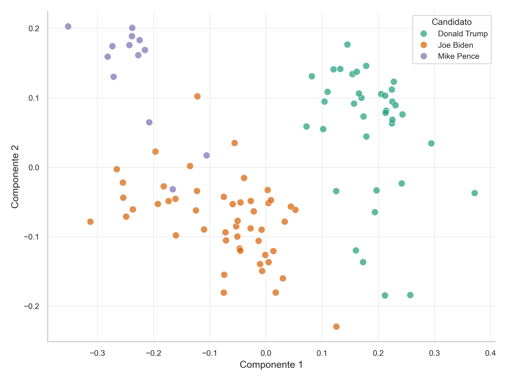{ width=65% #fig-pca1 fig-pos='htpb'}
:::

```{python}

# Gráfico de varianza explicada
fig, axes = plt.subplots(1, 2, figsize=(10, 5))
sns.set(style="whitegrid")

# Acumulada
axes[0].plot(range(1, 11), np.cumsum(pca.explained_variance_ratio_[:10]), marker='o', linestyle='-')
#axes[0].set_title('Varianza explicada acumulada (TF-IDF 1)', fontsize=12, weight='bold')
axes[0].set_xlabel('Número de componentes', fontsize=10)
axes[0].set_ylabel('Varianza explicada acumulada', fontsize=10)
axes[0].grid(alpha=0.3)
axes[0].set_xticks(range(1, 11))
axes[0].tick_params(labelsize=9)

# Individual
axes[1].plot(range(1, 11), pca.explained_variance_ratio_[:10], marker='o', linestyle='-')
#axes[1].set_title('Varianza explicada por componente (TF-IDF 1)', fontsize=12, weight='bold')
axes[1].set_xlabel('Número de componentes', fontsize=10)
axes[1].set_ylabel('Varianza explicada', fontsize=10)
axes[1].grid(alpha=0.3)
axes[1].set_xticks(range(1, 11))
axes[1].tick_params(labelsize=9)

plt.tight_layout()
plt.savefig("fig-pca2.png", dpi=350)
plt.close()
```

::: {.cell-output-display}
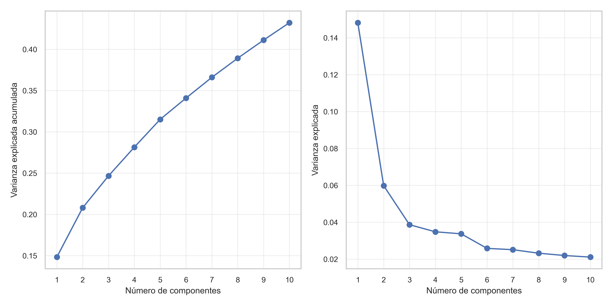{ width=85% #fig-pca2 fig-pos='htpb'}
:::

En una segunda versión del análisis PCA, se aplicaron dos modificaciones clave sobre el BoW: i) la eliminación de stopwords en inglés; y ii) la adición de bigramas al vocabulario.

La eliminación de stopwords contribuye a reducir el ruido introducido por términos frecuentes y semánticamente vacíos (como "the", "and", "of"), mejorando la capacidad del modelo para centrarse en términos informativos. Por su parte, la inclusión de bigramas enriquece el modelo al capturar expresiones características de cada candidato, tales como "middle class", "great again", o "health care", lo cual aporta contexto adicional a los unigramas aislados.

Curiosamente, la nueva representación (TF-IDF 2) explica una menor proporción de la varianza total en sus primeras dos componentes aproximadamente ~9 % ([@fig-pca4]), esto se explica por el aumento del tamaño del vocabulario y, en consecuencia, de la dimensionalidad. Esta nueva representación requiere de al menos 10 componentes para explicar la misma varianza que en la representación primera ([@fig-pca2]). Sin embargo, esta pérdida de varianza acumulada no compromete la capacidad discriminativa: de hecho, obervando la [@fig-pca3] con la representación de las primeras dos componentes, los clústeres por candidato aparecen incluso mejor definidos, lo que sugiere que las nuevas dimensiones, aunque más dispersas, contienen señales útiles para distinguir autores.

Finalmente, se espera que la omisión del filtrado de signos de puntuación tenga un efecto relevante en la representación; causando la introducción de tokens adicionales (como "economy." o "freedom,"), los cuales resultarán poco frecuentes en comparación a la misma palabra sin el signo de puntuación ("economy", "freedom"), recibiendo asi, bajo peso en la representación de la matriz TF-IDF, por lo que disminuiría la varianza explicada en las primeras componentes.

En síntesis, los resultados muestran que el PCA, combinado con una representación semánticamente informativa del texto, permite capturar diferencias estilísticas relevantes entre los discursos de campaña. Esto valida su utilidad como herramienta exploratoria previa a tareas de clasificación o modelado supervisado.

```{python}

# PCA sobre X_dev_tfidf2
pca2 = PCA(n_components=10)
X_dev_pca2 = pca2.fit_transform(X_dev_tfidf2.toarray())

# Gráfico PCA 2D
plt.figure(figsize=(8, 6))
sns.set(style="whitegrid")
ax = sns.scatterplot(
    x=X_dev_pca2[:, 0],
    y=X_dev_pca2[:, 1],
    hue=y_dev,
    palette="Dark2",
    alpha=0.7,
    s=60
)
plt.xlabel('Componente 1', fontsize=11)
plt.ylabel('Componente 2', fontsize=11)
#plt.title('Proyección PCA sobre el conjunto de desarrollo (TF-IDF 2)', fontsize=13, weight='bold')
plt.legend(title='Candidato', fontsize=9, title_fontsize=10)
plt.xticks(fontsize=9)
plt.yticks(fontsize=9)
plt.grid(alpha=0.3)
sns.despine()
plt.tight_layout()
plt.savefig("fig-pca3.png", dpi=350)
plt.close()
```

::: {.cell-output-display}
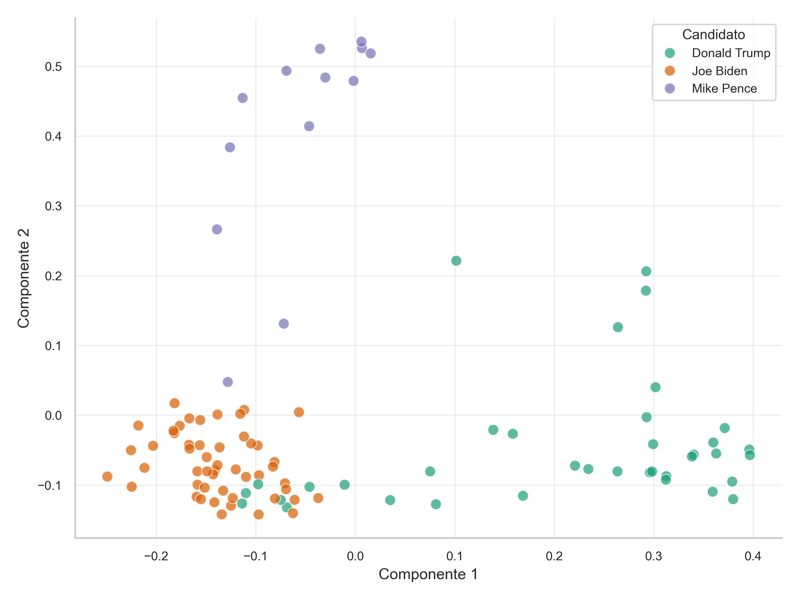{ width=65% #fig-pca3 fig-pos='htpb'}
:::


```{python}
# Gráfico de varianza explicada
fig, axes = plt.subplots(1, 2, figsize=(10, 5))
sns.set(style="whitegrid")

# Acumulada
axes[0].plot(range(1, 11), np.cumsum(pca2.explained_variance_ratio_[:10]), marker='o', linestyle='-')
#axes[0].set_title('Varianza explicada acumulada (TF-IDF 2)', fontsize=12, weight='bold')
axes[0].set_xlabel('Número de componentes', fontsize=10)
axes[0].set_ylabel('Varianza explicada acumulada', fontsize=10)
axes[0].grid(alpha=0.3)
axes[0].set_xticks(range(1, 11))
axes[0].tick_params(labelsize=9)

# Individual
axes[1].plot(range(1, 11), pca2.explained_variance_ratio_[:10], marker='o', linestyle='-')
#axes[1].set_title('Varianza explicada por componente (TF-IDF 2)', fontsize=12, weight='bold')
axes[1].set_xlabel('Número de componentes', fontsize=10)
axes[1].set_ylabel('Varianza explicada', fontsize=10)
axes[1].grid(alpha=0.3)
axes[1].set_xticks(range(1, 11))
axes[1].tick_params(labelsize=9)

plt.tight_layout()
plt.savefig("fig-pca4.png", dpi=350)
plt.close()
```

::: {.cell-output-display}
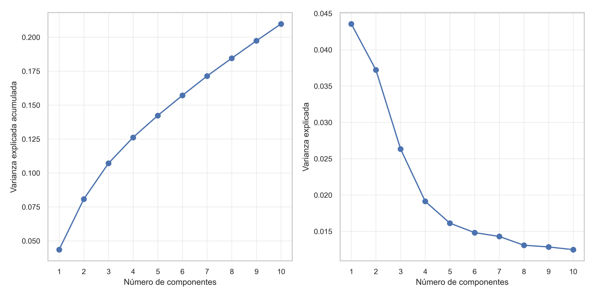{ width=85% #fig-pca4 fig-pos='htpb'}
:::


## Naive Bayes Multinomial

Una vez obtenida la representación numérica de los discursos mediante la transformación TF-IDF, se procede a entrenar un modelo de aprendizaje supervisado para clasificar los discursos según el candidato que los pronunció.

En este caso se utiliza el modelo **Naive Bayes Multinomial**, ampliamente utilizado en tareas de clasificación de texto por su simplicidad, rapidez y buenos resultados incluso con datos ruidosos o de alta dimensión.

El modelo se basa en el **Teorema de Bayes** [@jurafsky2023speech], que permite estimar la probabilidad de una clase $c$ dado un documento $d$:

$$
P(c \mid d) = \frac{P(c) \cdot P(d \mid c)}{P(d)}
$$

Como $P(d)$ es constante para todas las clases, el modelo predice la clase que maximiza la siguiente expresión:

$$
\hat{c} = \arg\max_c \left( P(c) \cdot P(d \mid c) \right)
$$

Para documentos representados como vectores de frecuencia de términos $\mathbf{x} = (x_1, x_2, \ldots, x_n)$, donde $x_i$ es el número de veces que aparece el término $i$, el modelo **multinomial** asume que:

$$
P(d \mid c) = \prod_{i=1}^n P(w_i \mid c)^{x_i}
$$

Donde $P(w_i \mid c)$es la probabilidad de observar la palabra $w_i$ en un documento de la clase $c$. Esta probabilidad se estima mediante:

$$
P(w_i \mid c) = \frac{N_{ic} + \alpha}{N_c + \alpha V}
$$

- $N_{ic}$: número total de ocurrencias del término $w_i$ en los documentos de la clase $c$  
- $N_c$: número total de palabras en los documentos de la clase $c$  
- $V$: tamaño del vocabulario  
- $\alpha$: parámetro de suavizado para evitar probabilidades cero que por defecto se establece en 1.

La predicción final se realiza entonces con:

$$
\hat{c} = \arg\max_c \left( \log P(c) + \sum_{i=1}^n x_i \log P(w_i \mid c) \right)
$$


### Métricas de evaluación

Para evaluar el desempeño del modelo entrenado se utiliza la *Matriz de confusión*, esta matriz, se puede representar a traves de una tabla, que muestra el número de predicciones correctas e incorrectas para cada clase, permitiendo identificar patrones de error, a partir de la cual se pueden calcular las siguientes métricas:

- **Accuracy**: proporción de predicciones correctas sobre el total de observaciones del conjunto de prueba:
$$
\text{Accuracy} = \frac{1}{N} \sum_{i=1}^{N} \mathbb{1}(y_i = \hat{y}_i)
$$

- **Precisión**: proporción de verdaderos positivos sobre el total de predicciones positivas para una clase:

$$
\text{Precision}_c = \frac{\text{TP}_c}{\text{TP}_c + \text{FP}_c}
$$

- **Recall (sensibilidad)**: proporción de verdaderos positivos sobre el total de instancias reales de la clase:

$$
\text{Recall}_c = \frac{\text{TP}_c}{\text{TP}_c + \text{FN}_c}
$$

En la [@fig-acc] se presentan los resultados del modelo sin optimizar aplicados al conjunto de test, utilizando las métricas mencionadas, cabe mencionar que nos encontramos con un problema importante para clasificar los discursos de los candidatos ya que si consideramos las predicciones del conjunto de test todas son para Biden, esto se puede ver mas en detalle en la matriz de confusión mencionada posteriormente y puede explicarse por el hecho de que Biden es el candidato con más discursos en el conjunto de entrenamiento y dada la representación optada para representar los discursos (BoW y TF-IDF), el modelo tiende a favorecer la clase con más discursos, lo que resulta en un sesgo hacia Biden. Esto pone de manifiesto la importancia de considerar el balance de clases y la importancia del ajuste de hiperparámetros para penalizar el modelo y evitar que se sobreajuste a la clase mayoritaria.

```{python}
# 1: Entrene el modelo Multinomial Naive Bayes, luego utilícelo para predecir sobre el conjunto de test, y reporte el valor de accuracy y la matriz de confusión. Reporte el valor de precision y recall para cada candidato. 
# Calcular matriz de confusión Sugerencia: utilice el método from_predictions de ConfusionMatrixDisplay para realizar la matriz.

# Entrenamiento del modelo Multinomial Naive Bayes
nb_model = MultinomialNB()
nb_model.fit(X_dev_tfidf, y_dev)

# Predicción sobre el conjunto de test
X_test_tfidf = TfidfTransformer().fit_transform(vectorizer.transform(X_test))
y_pred = nb_model.predict(X_test_tfidf)

sns.set(style="white")

# Reporte de accuracy
accuracy = accuracy_score(y_test, y_pred)
#print(f"Accuracy del modelo Naive Bayes: {accuracy:.2f}")
# Matriz de confusión
cm = confusion_matrix(y_test, y_pred, labels=top_3_candidates)
disp = ConfusionMatrixDisplay(confusion_matrix=cm, display_labels=top_3_candidates)
disp.plot(cmap=plt.cm.Blues)
#plt.title('Matriz de Confusión - Naive Bayes')
plt.savefig("fig-naive.png", dpi=350, bbox_inches="tight")
plt.close()
```

```{python}
#| label: fig-acc
#| fig-cap: Métricas de precisión y recall del modelo Naive Bayes por candidato en el conjunto de test.
# Reporte de precision y recall
precision = precision_score(y_test, y_pred, average=None, labels=top_3_candidates)
recall = recall_score(y_test, y_pred, average=None, labels=top_3_candidates)
from great_tables import GT
import pandas as pd

# Supongamos que ya tenés estas variables:
df_metrics = pd.DataFrame({
    "Candidato": top_3_candidates,
    "Precisión": precision,
    "Recall": recall
})

(
    GT(df_metrics)
    .cols_label(
        Candidato="Candidato",
        Precisión="Precisión",
        Recall="Recall"
    )
    .fmt_number(columns=["Precisión", "Recall"], decimals=2)
    #.tab_header(
        #title="Evaluación del modelo Naive Bayes",
        #subtitle="Precisión y Recall por candidato"
    #)
)
    
    
```

El accuracy del modelo sobre el conjunto de test resulta en un bajo valor de 0.49. En la [@fig-naive], se presenta la matriz de confusión, que muestra el número de aciertos y errores cometidos por el modelo al clasificar a cada candidato. Esta visualización permite identificar patrones sistemáticos de error, particularmente en la clasificación de los discursos de *Donald Trump* y *Mike Pence*, quienes no fueron correctamente identificados en ningún caso. Esto evidencia una limitada capacidad del modelo para distinguir entre ciertos oradores, lo que compromete su rendimiento en escenarios multiclase con discursos de estilos similares.

::: {.cell-output-display}
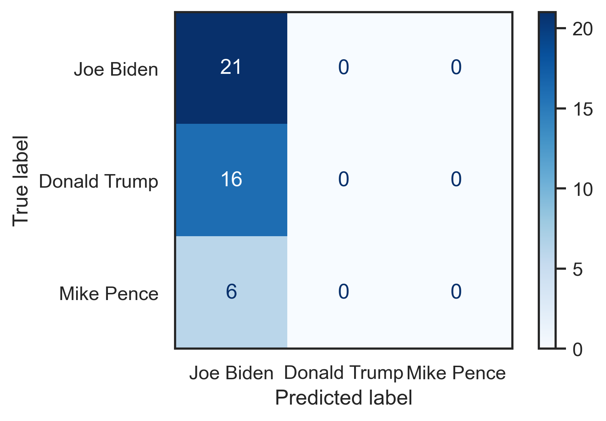{ width=67% #fig-naive fig-pos='htpb'}
:::


## Validación Cruzada y Búsqueda de Hiperparámetros

La validación cruzada (cross-validation) es una técnica utilizada para evaluar el desempeño de un modelo dividiendo el conjunto de datos en k subconjuntos o folds. En cada iteración, el modelo se entrena sobre $k – 1$ folds y se evalúa en el fold restante. Al promediar las métricas obtenidas en las k repeticiones, se obtiene una estimación más robusta del rendimiento del modelo, lo que permite mitigar el riesgo de sobreajuste asociado a depender de un único conjunto de validación. En este caso, se utilizó una validación cruzada con k=10.

Para optimizar los hiperparámetros del modelo, se utilizó la herramienta $\texttt{GridSearchCV}$, que permite explorar de forma sistemática todas las combinaciones posibles dentro de un espacio de parámetros definido. En cada iteración de la validación cruzada, se evalúa una combinación específica de hiperparámetros, y es posible visualizar la distribución de una métrica (como el accuracy) mediante un gráfico de violín, el cual muestra el valor promedio y la variabilidad del rendimiento entre los distintos folds.

Los resultados obtenidos muestran que el modelo Naive Bayes alcanza su mejor desempeño promedio con un parámetro de suavizado aditivo ($\alpha$) de 0.01. Bajo esta configuración, el modelo logra un accuracy perfecto del 100 % en el conjunto de validación, indicando que logra clasificar correctamente todos los discursos de los candidatos. Sin embargo, este rendimiento excepcional puede ser indicativo de sobreajuste: el modelo podría estar memorizando los datos de entrenamiento en lugar de aprender patrones generalizables.

Por este motivo, en lugar de seleccionar automáticamente el modelo con mayor precisión en entrenamiento, optamos por considerar valores de $\alpha$ que ofrecieran un balance razonable entre rendimiento promedio (accuracy entre 0.8 y 1) y capacidad de generalización, tal como se muestra en la figura [@fig-cv]. Esta figura ilustra en graficos de violín la distribución del accuracy promedio obtenido en cada combinación de hiperparámetros, permitiendo identificar visualmente las configuraciones más efectivas y estables, como se observa, a menor $\alpha$, el modelo tiende a sobreajustar, mientras que valores más altos reducen la precisión promedio.

```{python}
# 2: Implemente una búsqueda de hiperparámetros usando GridSearchCV.

GridSearchCV_params = {
    'alpha': [0.01, 0.02, 0.025, 0.03, 0.05, 0.1, 0.25, 0.5, 1],
    'fit_prior': [True, False]
}
grid_search = GridSearchCV(
    MultinomialNB(),
    param_grid=GridSearchCV_params,
    scoring='accuracy',
    cv=10,
    verbose=0,
    n_jobs=-1
)
grid_search.fit(X_dev_tfidf, y_dev)
#print("Mejores parámetros encontrados:")
#print(grid_search.best_params_)

# Genere una visualización que permita comparar las métricas (e.g: accuracy) de los distintos modelos entrenados, viendo el valor promedio y variabilidad de las mismas en todos los splits (e.g: en un gráfico de violín).
violin_data = pd.DataFrame(grid_search.cv_results_)
plt.figure(figsize=(12, 6))
sns.violinplot(x='param_alpha', y='mean_test_score', data=violin_data, inner='quartile')
#plt.title('Comparación de Accuracy por Parámetro Alpha en GridSearchCV')
plt.xlabel('Alpha')
plt.ylabel('Accuracy Promedio')
plt.xticks(rotation=0)
plt.grid()
plt.savefig("fig-cv.png", dpi=350, bbox_inches="tight")
plt.close()
```

::: {.cell-output-display}
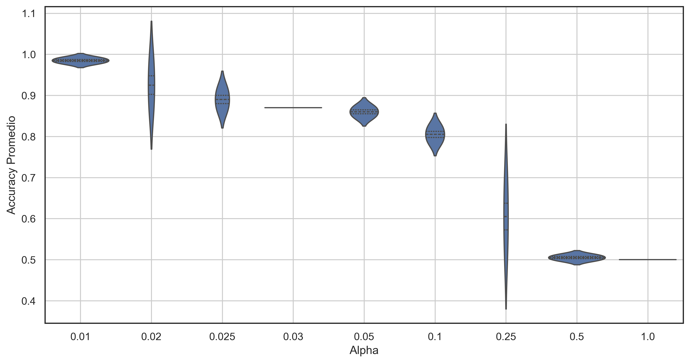{ width=80% #fig-cv fig-pos='htpb'}
:::

```{python}
# entrenamiento del modelo Multinomial Naive Bayes bajo el resultado de GridSearchCV
nb_model = MultinomialNB(alpha=0.01, fit_prior=True)
nb_model.fit(X_dev_tfidf, y_dev)

# Predicción sobre el conjunto de test
X_test_tfidf = TfidfTransformer().fit_transform(vectorizer.transform(X_test))
y_pred = nb_model.predict(X_test_tfidf)

# set sns set to none
sns.set(style="white")  # Fondo blanco sin grilla

# reporte de accuracy
accuracy = accuracy_score(y_test, y_pred)
#print(f"Accuracy del modelo Naive Bayes: {accuracy:.2f}")
# matriz de confusión
cm = confusion_matrix(y_test, y_pred, labels=top_3_candidates)
disp = ConfusionMatrixDisplay(confusion_matrix=cm, display_labels=top_3_candidates)
disp.plot(cmap=plt.cm.Blues)
#plt.title('Matriz de Confusión - Naive Bayes')

# reporte de precision y recall
precision = precision_score(y_test, y_pred, average=None, labels=top_3_candidates)
recall = recall_score(y_test, y_pred, average=None, labels=top_3_candidates)
#for candidate, prec, rec in zip(top_3_candidates, precision, recall):
#    print(f"Candidato: {candidate}, Precision: {prec:.2f}, Recall: {rec:.2f}")

plt.savefig("fig-cv2.png", dpi=350,bbox_inches="tight")
plt.close()

#::: {.cell-output-display}
#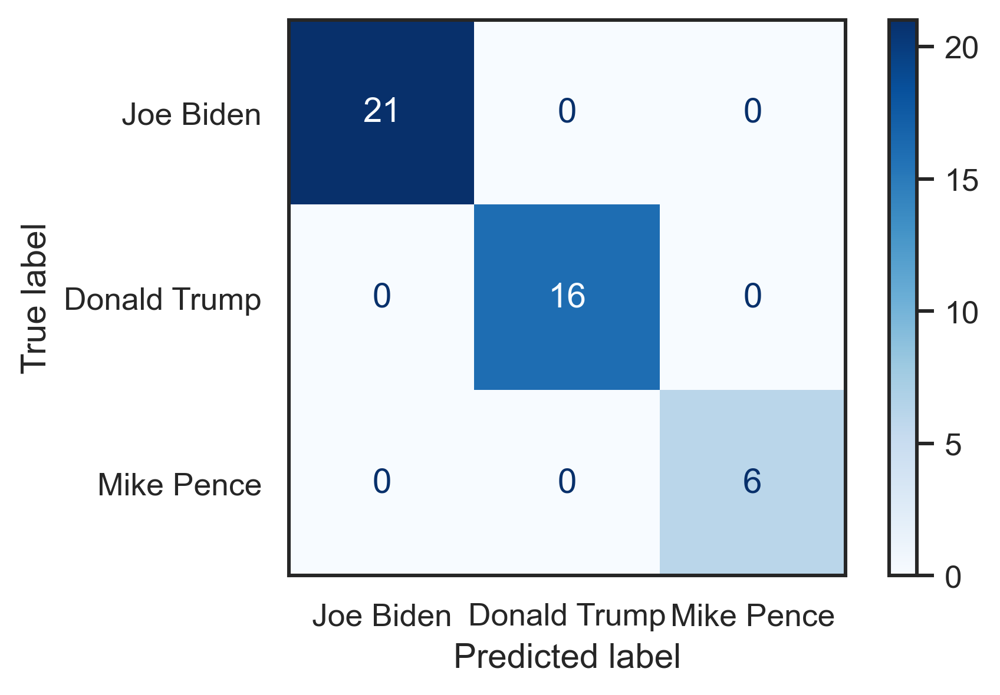{ width=67% #fig-cv2 fig-pos='htpb'}
#:::

```


## Selección del Mejor Modelo y Retrenamiento Completo

Una vez identificada la mejor combinación de hiperparámetros mediante validación cruzada, se procedió a reentrenar el modelo utilizando la totalidad del conjunto de entrenamiento, sin reservar un subconjunto para validación, y empleando dicha combinación óptima. En la figura [@fig-cv3] se muestra la matriz de confusión correspondiente al modelo final, mientras que en la [@fig-tab-cv] se reportan las métricas finales de precisión y recall por candidato. El accuracy del modelo final bajo un parametro $\alpha = 0.0275$ alcanza el 0.95, lo que indica un rendimiento sólido en la clasificación de discursos políticos.

Se observa un rendimiento perfecto en la clasificación de los discursos de Donald Trump, con una precisión, recall y accuracy de 1, ya que los 53 discursos fueron correctamente identificados. En el caso de Joe Biden, se lograron clasificar correctamente 71 discursos, aunque 4 discursos de Mike Pence fueron erróneamente asignados a Biden. Esto resulta en una sensibilidad (recall) perfecta de 1 para Biden, pero con una precisión de 0.95, afectada por las falsas positivas provenientes de Pence.

Por su parte, Mike Pence alcanza una precisión de 1.00, ya que todos los discursos que el modelo etiquetó como suyos efectivamente lo eran. Sin embargo, su recall se reduce a 0.79, debido a que varios de sus discursos fueron clasificados erróneamente como pertenecientes a Biden. Esta asimetría indica una confusión unidireccional, donde los discursos de Pence tienden a ser absorbidos por los discursos de Biden, pero no al revés.
```{python}
# 3: Elija el mejor modelo (mejores parámetros) y vuelva a entrenar sobre todo el conjunto de entrenamiento disponible (sin quitar datos para validación). Reporte el valor final de las métricas y la matriz de confusión.

#df_speeches_top_3["text"] 
#df_speeches_top_3["speaker"]
data = vectorizer.fit_transform(df_speeches_top_3["text"])
data_tfidf = TfidfTransformer(use_idf=True).fit_transform(data)

# entrenamiento del modelo Multinomial Naive Bayes bajo el resultado de GridSearchCV
nb_model = MultinomialNB(alpha=0.0275, fit_prior=True)
nb_model.fit(data_tfidf, df_speeches_top_3["speaker"])

# Predicción sobre el conjunto de test
y_pred = nb_model.predict(data_tfidf)

# set sns set to none
sns.set(style="white")  # Fondo blanco sin grilla

# reporte de accuracy
accuracy = accuracy_score(df_speeches_top_3["speaker"], y_pred)
#print(f"Accuracy del modelo Naive Bayes: {accuracy:.2f}")
# matriz de confusión
cm = confusion_matrix(df_speeches_top_3["speaker"], y_pred, labels=top_3_candidates)
disp = ConfusionMatrixDisplay(confusion_matrix=cm, display_labels=top_3_candidates)
disp.plot(cmap=plt.cm.Blues)
#plt.title('Matriz de Confusión - Naive Bayes')
plt.savefig("fig-cv3.png", dpi=350,bbox_inches="tight")
plt.close()

# reporte de precision y recall
precision = precision_score(df_speeches_top_3["speaker"], y_pred, average=None, labels=top_3_candidates)
recall = recall_score(df_speeches_top_3["speaker"], y_pred, average=None, labels=top_3_candidates)
#for candidate, prec, rec in zip(top_3_candidates, precision, recall):
#    print(f"Candidato: {candidate}, Precision: {prec:.2f}, Recall: {rec:.2f}")

```

::: {.cell-output-display}
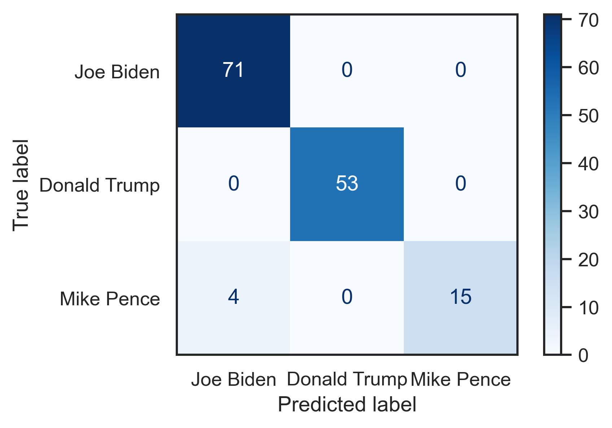{ width=67% #fig-cv3 fig-pos='htpb'}
:::

```{python}
#| label: fig-tab-cv
#| fig-cap: Métricas de precisión y recall del modelo bajo optimización de hiperparámetros.

df_metrics = pd.DataFrame({
    "Candidato": top_3_candidates,
    "Precisión": precision,
    "Recall": recall
})

(
    GT(df_metrics)
    .cols_label(
        Candidato="Candidato",
        Precisión="Precisión",
        Recall="Recall"
    )
    .fmt_number(columns=["Precisión", "Recall"], decimals=2)
    #.tab_header(
        #title="Evaluación del modelo Naive Bayes",
        #subtitle="Precisión y Recall por candidato"
    #)
)
```


## Regresión Logística

Además de Naive Bayes, se evaluó Regresión Logística, un modelo lineal que estima probabilidades usando softmax sobre combinaciones lineales de features.

La Regresión Logística es un modelo lineal que estima las probabilidades de pertenencia a cada clase aplicando la función softmax sobre una combinación lineal de las features. Para cada clase c, se calcula:

$$
P(c \mid \mathbf{x}) = \frac{e^{\mathbf{w}_c^\top \mathbf{x} + b_c}}{\sum_{k} e^{\mathbf{w}_k^\top \mathbf{x} + b_k}}
$$

donde $\mathbf{w}_c$ y $b_c$ son los parámetros asociados a la clase c. Dicho modelo se entrena maximizando la verosimilitud, usualmente a través de métodos numéricos como el algoritmo de Newton-Raphson (NR), el cual ajusta iterativamente los pesos y el sesgo para maximizar la función de verosimilitud y acercar las probabilidades predichas a las etiquetas reales. A diferencia de Naive Bayes, que estima $P(x \mid c)$ y aplica la regla de Bayes, la Regresión Logística modela directamente la probabilidad condicional $P(c \mid \mathbf{x})$, permitiendo capturar interacciones lineales entre las variables.

\newpage

En este modelo existen dos hiperparámetros principales:

- **C**: inverso de la regularización, controla la complejidad del modelo. Valores más altos permiten mayor flexibilidad, mientras que valores bajos penalizan más las magnitudes de los coeficientes. 

- **penalty**: tipo de regularización a aplicar (L1, L2 o ninguna). La regularización L1 tiende a generar modelos más esparsos, mientras que L2 penaliza las magnitudes de los coeficientes sin forzarlos a cero. 

Se define una cuadricula de valores de $C$ en [0.01, 0.1, 1, 10] en conjunto con las penalizaciones L1, L2 y elasticnet. Se utiliza el método de validación cruzada con 10 folds para evaluar el rendimiento del modelo en cada combinación de hiperparámetros. Posteriormente, se entrena el modelo con los mejores parámetros encontrados ($C = 10$ y $penalty=l2$) y se evalúa su rendimiento en el conjunto de test resultando en un accuracy del 98% donde el modelo logra clasificar correctamente todos los discursos de los candidatos a excepción de uno de Biden que lo confundió con Pence. 

```{python}
param_grid_lr = {
    'C': [0.01, 0.1, 1, 10],
    'penalty': ['l2', 'l1', 'elasticnet'],
    'solver': ['lbfgs']
}
gr_lr = GridSearchCV(
    LogisticRegression(max_iter=1000, random_state=42),
    param_grid=param_grid_lr,
    scoring='accuracy',
    cv=10,
    n_jobs=-1
)
gr_lr.fit(X_dev_tfidf, y_dev)

disp_lr = ConfusionMatrixDisplay.from_estimator(
    gr_lr.best_estimator_,
    X_test_tfidf,
    y_test,
    display_labels=top_3_candidates,
    cmap='Blues'
)
#disp_lr.ax_.set_title('Matriz de Confusión - Logistic Regression (GridSearchCV)')
plt.savefig("fig-logistic.png", dpi=350, bbox_inches="tight")
plt.close()
```

::: {.cell-output-display}
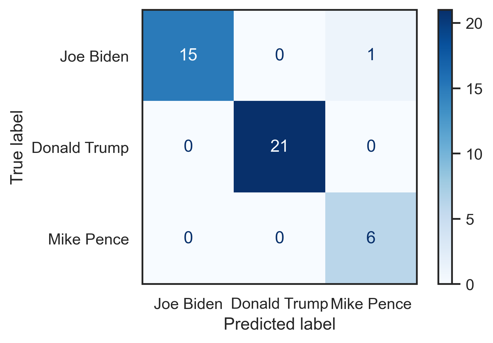{ width=67% #fig-logistic fig-pos='htpb'}
:::


## Consideraciones sobre el desbalance y extracción alternativa de features

El análisis de componentes principales (PCA) realizado reemplazando a Mike Pence por Kamala Harris muestra que la selección de candidatos impacta directamente en el balance de clases y en la capacidad del modelo para generalizar. En este nuevo escenario, la proporción de discursos correspondientes al tercer candidato disminuye: se pasa de un 13 % con Mike Pence a tan solo 8 % con Kamala Harris, acentuando el desbalance original en la distribución de clases.

El desbalance de clases es un aspecto crítico en problemas de clasificación multiclase, ya que puede sesgar al modelo hacia las clases mayoritarias, deteriorando su capacidad para identificar correctamente las clases menos representadas. En este caso, la modificación en la selección de candidatos provoca una distribución aún más desequilibrada, lo que puede afectar negativamente tanto el entrenamiento como la evaluación del modelo.

La figura [@fig-pca_kamala] muestra la proyección PCA de los discursos de Biden, Trump y Kamala Harris, donde se observa una mayor superposición entre las clases, particularmente entre los discursos de Kamala Harris y los de Joe Biden. Esta menor capacidad de separación en el espacio proyectado contrasta con la configuración anterior con Mike Pence, donde las clases estaban más claramente delimitadas. Este patrón sugiere que los discursos de Kamala Harris son más similares en estilo y contenido a los de Biden, lo cual resulta coherente desde un punto de vista político, dado que ambos pertenecen al mismo partido y compartieron fórmula presidencial.

```{python}
# 5: Evalúe el problema cambiando al menos un candidato. En particular, observe el (des)balance de datos y los problemas que pueda generar, así como cualquier indicio que pueda ver en el mapeo previo con PCA.
top_3_candidates = df_speeches_clean["speaker"].value_counts().head(5).index
# descartamos al tercer candidato
top_3_candidates = top_3_candidates.drop(top_3_candidates[2])
top_3_candidates = top_3_candidates.drop(top_3_candidates[2])
#print(f"Top 3 candidatos: {top_3_candidates}")
# print("---------------")

df_speeches_top_3 = df_speeches_clean[
     df_speeches_clean["speaker"].isin(top_3_candidates)
].reset_index(drop=True)


# 1: Separar 30% del conjunto para test. Al resto lo llamamos "dev" (desarrollo).

X_dev, X_test, y_dev, y_test = train_test_split(
    df_speeches_top_3["text"], 
    df_speeches_top_3["speaker"], 
    stratify=df_speeches_top_3["speaker"], 
    test_size=0.3, 
    random_state=42
)


# 3: Transforme el texto del conjunto de entrenamiento a la representación numérica (features) de conteo de palabras o bag of words.

vectorizer = CountVectorizer(
    stop_words=None,
    lowercase=True,
    token_pattern=r"(?u)\b\w+\b",
    ngram_range=(1, 1)
    
)

X_dev_counts = vectorizer.fit_transform(X_dev)
#print(f"Dimensiones de la matriz de conteo: {X_dev_counts.shape}")
#print(f"Proporción de entradas no cero: {X_dev_counts.nnz / X_dev_counts.shape[0] / X_dev_counts.shape[1]}")
vectorizer2 = CountVectorizer(
    stop_words=stopwords.words("english"),
    lowercase=True,
    token_pattern=r"(?u)\b\w+\b",
    ngram_range=(1, 2)
    
)

X_dev_counts2 = vectorizer2.fit_transform(X_dev)

#print(f"Dimensiones de la matriz de conteo: {X_dev_counts2.shape}")
#print(f"Proporción de entradas no cero: {X_dev_counts2.nnz / X_dev_counts2.shape[0] / X_dev_counts2.shape[1]}")


# 4: Obtenga la representación numérica Term Frequency - Inverse Document Frequency.

X_dev_tfidf = TfidfTransformer(use_idf=True).fit_transform(X_dev_counts)
#print(f"Dimensiones de la matriz TF-IDF: {X_dev_tfidf.shape}")

X_dev_tfidf2 = TfidfTransformer(use_idf=True).fit_transform(X_dev_counts2)


# 5 :Muestre en un mapa el conjunto de entrenamiento, utilizando las dos primeras componentes PCA sobre los vectores de tf-idf.

pca = PCA(n_components=10)
X_dev_pca = pca.fit_transform(X_dev_tfidf.toarray())

# Visualización de las dos primeras componentes PCA
plt.figure(figsize=(10, 6))
sns.scatterplot(
    x=X_dev_pca[:, 0], 
    y=X_dev_pca[:, 1], 
    hue=y_dev, 
    palette='Dark2', 
    alpha=0.7
)
plt.xlabel('Componente PCA 1')
plt.ylabel('Componente PCA 2')
plt.grid()
plt.savefig("fig-pca_kamala.png", dpi=350, bbox_inches="tight")
plt.close()

# Haga una visualización que permita entender cómo varía la varianza explicada a medida que se agregan componentes (e.g: hasta 10 cplt.figure(figsize=(10, 6))
fig, axes = plt.subplots(1, 2, figsize=(12, 6))

# Primer gráfico: varianza explicada acumulada
axes[0].plot(range(1, 11), np.cumsum(pca.explained_variance_ratio_[:10]), marker='o')
#axes[0].set_title('Varianza explicada acumulada por componentes PCA')
axes[0].set_xlabel('Número de componentes PCA')
axes[0].set_ylabel('Varianza explicada acumulada')
axes[0].grid()
axes[0].set_xticks(range(1, 11))

# Segundo gráfico: varianza explicada individual
axes[1].plot(range(1, len(pca.explained_variance_ratio_) + 1), pca.explained_variance_ratio_, marker='o')
#axes[1].set_title('Varianza explicada por cada componente PCA')
axes[1].set_xlabel('Número de componentes PCA')
axes[1].set_ylabel('Varianza explicada')
axes[1].grid()
axes[1].set_xticks(range(1, len(pca.explained_variance_ratio_) + 1))

plt.tight_layout()
plt.savefig("fig-pca_varianza.png", dpi=350, bbox_inches="tight")
plt.close()

```

::: {.cell-output-display}
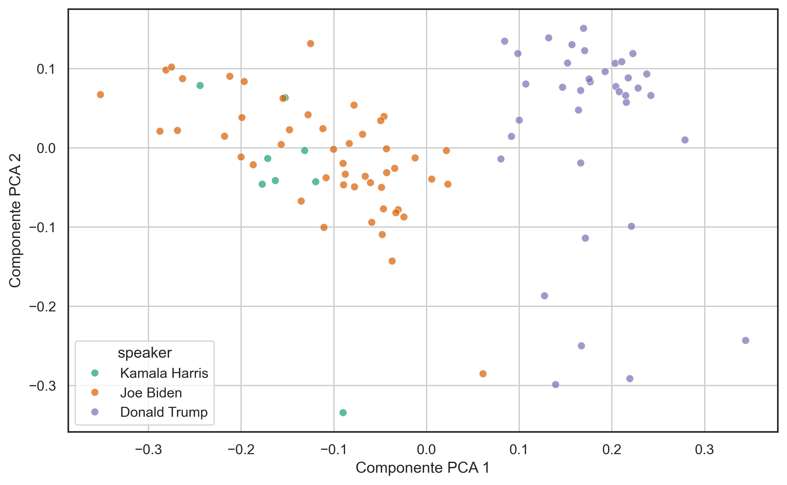{ width=65% #fig-pca_kamala fig-pos='htpb'}
:::
 
Por otro lado, la figura [@fig-pca_varianza] presenta la varianza explicada acumulada e individual por componente en la representación TF-IDF. En este caso, las primeras dos componentes explican aproximadamente un 18 % de la varianza total, una proporción ligeramente inferior a la observada en la configuración con Mike Pence (ver figura [@fig-pca2]). Este resultado refuerza la idea de que las primeras componentes no logran capturar gran parte de la variabilidad presente en el conjunto de datos, posiblemente debido a la mayor similitud discursiva entre Harris y Biden. Esta observación sugiere que existe un estilo retórico compartido entre ambos candidatos, lo que podría dificultar la discriminación automática de sus discursos en el espacio latente proyectado.

::: {.cell-output-display}
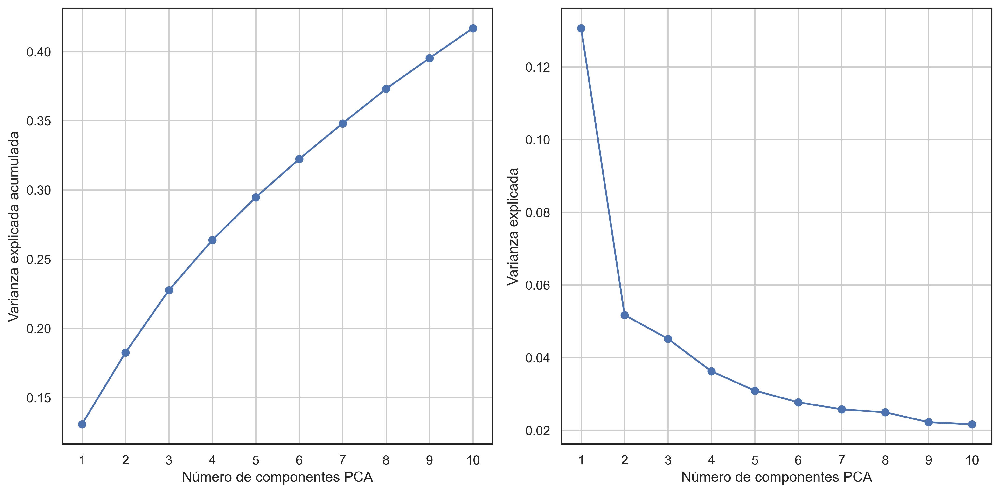{ width=85% #fig-pca_varianza fig-pos='htpb'}
:::


Una consideración adicional es que, en Python, la librería \texttt{imbalanced-learn} implementa diversas técnicas de remuestreo—entre ellas SMOTE y otras variantes, lo que facilita su integración en pipelines de \texttt{scikit-learn} para manejar el desbalance de clases.


## Alternativas de Extracción de Features

En el ámbito del procesamiento de lenguaje natural, existen diversas técnicas para representar texto como vectores numéricos. A continuación se describen algunas de las más relevantes:

### Word2Vec
Word2Vec [@mikolov2013distributed] aprende vectores densos de palabras mediante modelos de Continuous Bag-of-Words (CBOW) o Skip-Gram, optimizando la predicción de palabras y su contexto. Cada palabra se representa como un vector de dimensión fija, donde la cercanía en el espacio refleja similitud semántica.

**Diferencias vs. BoW/TF-IDF:** reducción de dimensionalidad, vectores densos que capturan relaciones semánticas y mejor generalización.

### GloVe
GloVe [@pennington2014glove] crea embeddings a partir de la factorización de una matriz de co-ocurrencia global de palabras. Los vectores resultantes preservan información tanto local (contexto de ventana) como global (distribución en el corpus).

**Diferencias vs. Word2Vec:** incorpora estadísticas globales del corpus, lo que puede mejorar la representación de palabras infrecuentes; sigue siendo estático.

### Embeddings Contextuales
Modelos como BERT [@devlin2019bert] generan vectores dinámicos que dependen del contexto completo de la frase. Cada instancia de una palabra recibe un embedding distinto según su uso, capturando matices sintácticos y semánticos más profundos.

**Diferencias vs. estáticos:** embeddings sensibles al contexto, mayor capacidad para desambiguar significados, a costa de mayor complejidad computacional.

## Conclusiones

El presente trabajo demuestra que la combinación de técnicas clásicas de representación de texto (Bag of Words y TF-IDF) con algoritmos supervisados de clasificación resulta eficaz para diferenciar entre discursos políticos de la campaña presidencial estadounidense de 2020. Tras la optimización de hiperparámetros, el modelo Multinomial Naive Bayes obtuvo una exactitud del 95 %, mientras que la Regresión Logística, adecuadamente regularizada, alcanzó un 98 % de aciertos en el conjunto de prueba. Estos resultados confirman la capacidad de ambos métodos para capturar patrones léxicos distintivos de cada orador aun en un dominio tan heterogéneo como el discurso político.

El análisis exploratorio mediante PCA evidenció que las dos primeras componentes principales concentran una fracción limitada de la varianza total, aunque suficiente para revelar agrupamientos claros entre candidatos. Asimismo, el reemplazo de Mike Pence por Kamala Harris mostró un incremento en el solapamiento de clases y puso de manifiesto la importancia del balance de datos: una menor representación de una clase reduce la capacidad discriminativa y acentúa la confusión con candidatos de estilo retórico similar. De allí se desprende la conveniencia de aplicar técnicas de remuestreo o pérdidas ponderadas cuando la distribución de clases sea marcadamente desigual.

En conclusión, el estudio confirma la utilidad de los métodos de ciencia de datos para caracterizar y clasificar discursos políticos, al tiempo que señala los desafíos que plantean la alta dimensionalidad, el desbalance de clases y la necesidad de representaciones semánticamente más ricas. 

\newpage

### Referencias {#references}


