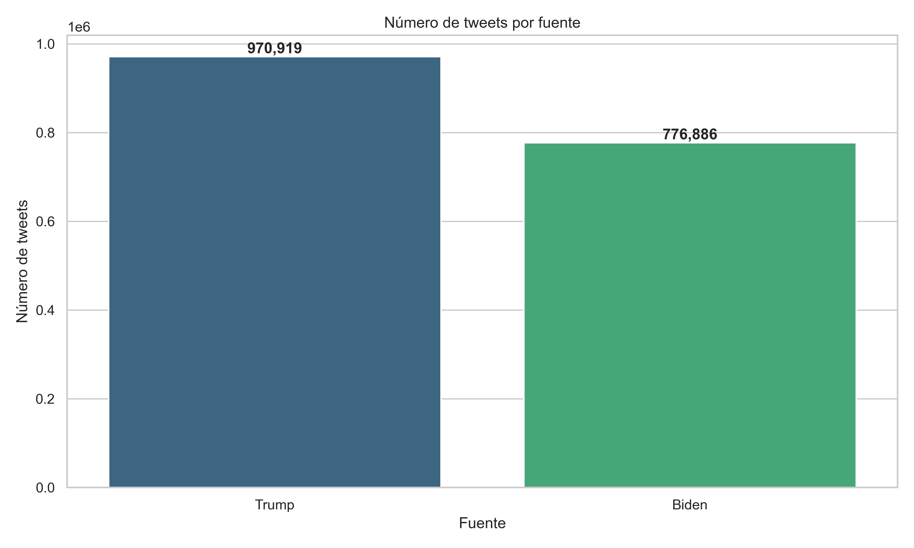
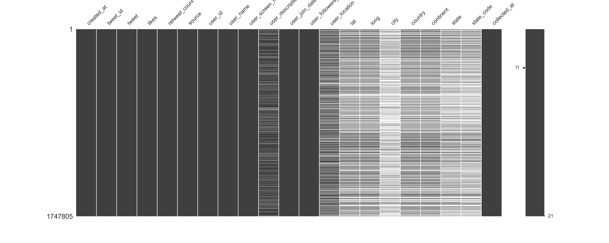

```{python}
#| echo: false
#| eval: false

import kagglehub

path = kagglehub.dataset_download("manchunhui/us-election-2020-tweets")

import zipfile
with zipfile.ZipFile(path, 'r') as zip_ref:
    zip_ref.extractall("us-election-2020-tweets")

```

```{python}
#| echo: false
#| eval: false

import polars as pl

trump = pl.read_csv("us-election-2020-tweets/hashtag_donaldtrump.csv")
trump = trump.with_columns(pl.lit('Trump').alias('source'))

biden = pl.read_csv("us-election-2020-tweets/hashtag_joebiden.csv")
biden = biden.with_columns(pl.lit('Biden').alias('source'))

full_data = pl.concat([trump, biden])

# Plot the number of tweets by source with Seaborn
import seaborn as sns
import matplotlib.pyplot as plt
sns.set_theme(style="whitegrid")
plt.figure(figsize=(8, 6))

# Count tweets by source
tweet_counts = full_data.group_by('source').agg(pl.count().alias('count'))

# Create bar plot
sns.barplot(data=tweet_counts.to_pandas(), x='source', y='count', palette='viridis')
plt.title('Número de tweets por fuente')
plt.xlabel('Fuente')
plt.ylabel('Número de tweets')

for i, v in enumerate(tweet_counts.select('count').to_numpy().flatten()):
    plt.text(i, v + 1000, f'{v:,}', ha='center', va='bottom', fontweight='bold')

plt.tight_layout()
plt.savefig("tweets_by_source.png", dpi=350)
plt.close()
```

## Introducción


Para esta tarea final, se utilizará el conjunto de datos referido a los tweets relacionados con la elección presidencial de los Estados Unidos de 2020, para continuar con la temática analizada en las tareas 1 y 2. Este conjunto de datos se encuentra disponible de forma pública en la plataforma [Kaggle](https://www.kaggle.com/datasets/manchunhui/us-election-2020-tweets).

Esta tarea final complementa los análisis previos aplicando las herramientas y conceptos desarrollados en las tareas anteriores a un nuevo contexto de datos. Mientras que en la Tarea 1 se exploró el pipeline de ciencia de datos y la calidad de datos utilizando discursos presidenciales, y en la Tarea 2 se profundizó en técnicas de procesamiento de texto y modelado predictivo, esta tarea final extiende el análisis al ámbito de las redes sociales durante el mismo período electoral. De esta manera, se obtiene una perspectiva más completa del discurso político en 2020, combinando tanto las comunicaciones oficiales (discursos) como las conversaciones públicas (tweets), y permitiendo evaluar la consistencia y aplicabilidad de las metodologías de ciencia de datos en diferentes tipos de datos textuales. 

Los tweets fueron extraídos con la API de Twitter buscando por los hashtags `#JoeBiden`, `#Biden`, `#Trump` y `#DonaldTrump` entre el 15 de octubre de 2020 y el 8 de noviembre de 2020. En total se tiene un conjunto de 1.747.805 tweets, donde Trump presenta una mayoría de tweets respecto a Biden como se observa en la figura [@fig-tweets-by-source]. 

::: {.cell-output-display}
{ width=60% #fig-tweets-by-source fig-pos='htpb'}
:::

Al momento de la extracción de los datos, en el año 2020, la API de Twitter (v1.1) ofrecía acceso gratuito a través de un modelo de autenticación simple (OAuth 1.0a), que permitía consultar endpoints públicos como la búsqueda de tweets recientes, la línea de tiempo de un usuario y metadatos asociados (retweets, likes, ubicación, idioma, etc.). En contraste, a partir de 2023, tras los cambios en la política de acceso bajo la nueva gestión de Twitter (X), la API pasó a ofrecerse bajo un modelo mayoritariamente pago. La versión gratuita actual es extremadamente restringida (por ejemplo, 500 tweets al mes) y ya no permite búsquedas avanzadas. El acceso a volúmenes mayores o funcionalidades clave (como búsqueda histórica, engagement o seguimiento en tiempo real) requiere suscripciones mensuales, incluso para cuentas académicas. 

Esto sería algo a considerar si se deseara replicar el análisis en el futuro o realizar nuevos análisis sobre datos de Twitter, este tipo de extracción de datos tenía una calidad relativamente buena y permitía obtener una gran cantidad de tweets.

## Descripción de los datos

::: {=latex}
\begin{center}
\begin{tabular}{|p{3cm}|p{5cm}|p{3cm}|p{5cm}|}
\hline
\textbf{Variable} & \textbf{Descripción} & \textbf{Variable} & \textbf{Descripción} \\
\hline
created\_at & Fecha y hora de publicación del tweet & tweet\_id & Identificador único del tweet \\
\hline
text & Contenido textual del tweet & likes & Número de "me gusta" recibidos \\
\hline
retweet\_count & Número de retweets recibidos & source & Candidato asociado al tweet (Trump o Biden) \\
\hline
user\_id & Identificador único del usuario & user\_name & Nombre del usuario \\
\hline
user\_screen\_name & Nombre de usuario (handle) & user\_description & Descripción del perfil del usuario \\
\hline
user\_join\_date & Fecha de creación de la cuenta del usuario & user\_followers\_count & Número de seguidores \\
\hline
user\_location & Ubicación declarada del usuario & lat & Latitud del tweet (si disponible) \\
\hline
long & Longitud del tweet (si disponible) & city & Ciudad geolocalizada del tweet \\
\hline
country & País del tweet & continent & Continente del tweet \\
\hline
state & Estado del tweet (si disponible) & state\_code & Código del estado del tweet \\
\hline
\end{tabular}
\end{center}
:::


La estructura de los datos es bastante consistente, pero sería importante tener en cuenta que algunas columnas podrían contener valores nulos o no estar disponibles para todos los tweets, especialmente las relacionadas con la ubicación (`lat`, `long`, `city`, `country`, `continent`, `state`, `state_code`). Estas características fueron incluidas a partir de ciertas fechas en la extracción de los tweets, lo que podría afectar el análisis espacial de los mismos.

Para analizar la calidad de los datos de una forma rápida, se utiliza la librería `missingno` para visualizar los valores nulos en el conjunto de datos. Esto permite identificar rápidamente las columnas con mayor cantidad de datos faltantes, un ejemplo se muestra en la [@fig-missingno-tweets].

```{python}
#| echo: false
#| eval: false
#| fig-alt: "Visualización de datos faltantes en el conjunto de datos de tweets"
#| fig-label: fig:missingno-tweets
import missingno as msno
import matplotlib.pyplot as plt
msno.matrix(full_data.to_pandas())
plt.savefig("missingno_tweets.png", dpi=350)
plt.close()
```

::: {.cell-output-display}
{ width=85% #fig-missingno-tweets fig-pos='htpb'}
:::

Como se puede observar en la figura, la mayoría de las columnas tienen una cantidad significativa de datos, pero algunas columnas relacionadas con la ubicación (`lat`, `long`, `city`, `country`, `continent`, `state`, `state_code`) tienen una cantidad considerable de valores nulos. Esto sería esperado ya que no todos los tweets contienen información de ubicación dependiendo de la configuración de privacidad del usuario y la disponibilidad de datos en el momento de la publicación. Además, se puede ver que la descripción del usuario (`user_description`) tiene una gran cantidad de datos nulos, lo cual podría ser normal ya que no todos los usuarios completan su perfil con una descripción.

Este conjunto de datos permitiría identificar claramente los picos de actividad relacionados con eventos específicos de la campaña electoral, como se observa en los debates presidenciales y crisis mediáticas. Esta granularidad temporal sería fundamental para entender cómo los eventos políticos influyen en la conversación digital y el engagement de los usuarios.

## Planteamiento del problema

Con este conjunto de datos, nos plantearíamos investigar cómo evolucionó el discurso político en Twitter durante los últimos meses de la campaña electoral de 2020. La pregunta central que guiaría nuestro análisis es: **¿De qué manera se diferenció la dinámica de engagement y actividad temporal entre los candidatos, y qué eventos específicos marcaron puntos de inflexión en la conversación digital?**

Este análisis se enfocaría en cuatro aspectos complementarios. Primero, buscaríamos identificar si existieron momentos específicos durante la campaña donde la actividad en Twitter experimentó picos significativos, particularmente en relación con eventos como debates presidenciales, anuncios de políticas importantes o crisis mediáticas. El análisis temporal nos permitiría detectar estos patrones y relacionarlos con el calendario electoral.

Segundo, nos interesaría examinar las diferencias en el nivel de engagement que generaron los contenidos relacionados con cada candidato. Esto incluiría no solo el volumen de tweets, sino también métricas como retweets y likes, que nos indicarían el nivel de resonancia que tuvo cada mensaje en la audiencia. También exploraríamos si existe una correlación entre el número de seguidores de los usuarios y el impacto de sus tweets.

El tercer aspecto se centraría en el análisis del contenido mismo. Utilizando técnicas de procesamiento de lenguaje natural, buscaríamos identificar los temas predominantes en las conversaciones sobre cada candidato y cómo estos evolucionaron a lo largo del tiempo. Además, implementaríamos análisis de sentimientos para detectar patrones en las percepciones públicas expresadas en la plataforma.

Finalmente, en caso de contar con datos de geo-localización suficientes, se examinaría si existen diferencias regionales en los patrones de actividad y engagement, lo que podría revelar concentraciones geográficas de apoyo o crítica hacia cada candidato.

## Abordaje Metodológico

Para abordar estas preguntas de investigación, seguiríamos un proceso metodológico estructurado en varias etapas. Primero, realizaríamos un análisis exploratorio exhaustivo de los datos para comprender mejor su estructura y calidad, identificando patrones temporales básicos y detectando posibles problemas de completitud o consistencia.

En la etapa de análisis temporal, aplicaríamos técnicas de series de tiempo para examinar la evolución diaria y semanal de la actividad en Twitter. Esto incluiría la creación de visualizaciones como gráficos de líneas temporales y mapas de calor para identificar picos de actividad. Para poder relacionar estos picos con eventos específicos, cruzaríamos nuestros hallazgos con un calendario electoral detallado que incluya fechas de debates, anuncios importantes y crisis mediáticas.

El análisis de contenido textual emplearía técnicas como TF-IDF para identificar términos característicos de cada candidato, y explorar en algoritmos de modelado de tópicos como LDA (Latent Dirichlet Allocation) o BERTopic (BERT Topic Modeling) para descubrir temas recurrentes. Para el análisis de sentimientos, implementaríamos herramientas como VADER o modelos pre-entrenados en tanto en español como inglés, etiquetaríamos una muestra representativa de tweets manualmente para validar los resultados y ajustar los modelos según sea necesario.

En caso de contar con datos geográficos suficientes, crearíamos visualizaciones cartográficas y análisis de concentración espacial para identificar patrones regionales. Todas las visualizaciones seguirían principios de diseño claro y comunicación efectiva, utilizando gráficos de barras, líneas temporales, nubes de palabras y mapas según corresponda.

## Consideraciones éticas

El análisis de datos de redes sociales como Twitter plantea importantes consideraciones éticas que deben ser abordadas para asegurar la integridad y responsabilidad del proyecto.

**Privacidad de los datos:** Aunque los tweets son públicos, pueden contener información personal como nombres de usuario, ubicación o descripciones. Es fundamental respetar la privacidad, evitar la exposición de información sensible y, cuando sea posible, anonimizar los datos. Además, se debe cumplir con los términos de servicio de Twitter y regulaciones de protección de datos como el GDPR o la CCPA.

**Sesgos en los datos y algoritmos:** Twitter no representa a la población general. Es común que haya sesgos de auto-selección o predominancia de ciertos grupos demográficos, lo que puede distorsionar los análisis y las conclusiones. Asimismo, los algoritmos de procesamiento de lenguaje natural pueden amplificar estos sesgos, malinterpretar sarcasmo o favorecer ciertos patrones lingüísticos. Por ello, es importante realizar análisis exploratorios para detectar sesgos y, si es necesario, aplicar técnicas de ajuste o balanceo.

**Impacto de los resultados:** Los hallazgos podrían influir en la opinión pública, decisiones políticas o la cobertura mediática. Una interpretación inadecuada podría reforzar estereotipos o contribuir a la desinformación. Por ello, es clave comunicar de forma transparente las limitaciones del estudio y evitar afirmaciones categóricas. Los resultados solo reflejarán tendencias dentro de Twitter, no de la población general.

**Estrategias para identificar, evaluar y mitigar riesgos:**

- Anonimizar los datos y limitar el acceso a información sensible.

- Documentar y comunicar claramente las limitaciones y posibles sesgos de los datos y métodos utilizados.

- Validar los algoritmos y revisar si existe sesgo en su desempeño.

- Promover la transparencia en la metodología y permitir la reproducibilidad del análisis.

En resumen, un enfoque ético en el análisis de datos de redes sociales requeriría atención a la privacidad, la equidad y la transparencia, así como la adopción de medidas proactivas para minimizar riesgos y maximizar la explotación responsable de los datos.
